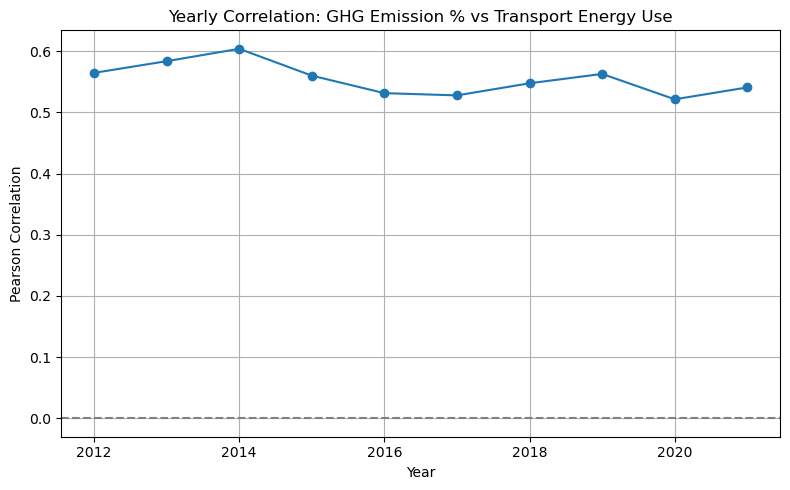

# Transport Emissions & Energy Analysis

A data-driven analysis combining environmental, economic, and behavioural factors to understand emissions dynamics and inform sustainability strategies.

This project explores the relationship between transport energy consumption and greenhouse gas (GHG) emissions across OECD countries, with a focus on New Zealand.

Developed as part of a **group project in Business Analytics Tools course**, the analysis integrates multiple datasets and applies data analysis, statistical methods, and data collection techniques to uncover key patterns in sustainability and economic growth.

## Overview

To understand how emissions evolve and what drives them, this project analyzes data from **2012 to 2021 across OECD countries**.

The analysis integrates multiple datasets, including:
- GHG emissions and transport energy use  
- GDP and economic indicators  
- External innovation data collected via web scraping  

The goal is to assess:
- Whether New Zealand is improving in emissions efficiency  
- What factors drive transport-related emissions  
- How economic growth interacts with environmental impact  

## Key Insights

**1. New Zealand is improving — but still above benchmark**  
Transport GHG intensity has declined over time, but remains higher than the OECD median, indicating room for improvement.

**2. Economic growth does not guarantee emissions efficiency**  
Countries with strong GDP growth do not always achieve proportional reductions in emissions intensity. New Zealand shows moderate improvement but not leading performance.

**3. Transport energy use is a key driver of emissions**  
A strong positive relationship exists between transport energy consumption and emissions across countries. New Zealand follows this pattern.

**4. The relationship is consistent over time**  
Correlation between energy use and emissions remains stable across years (~0.5–0.6), reinforcing the structural nature of this relationship.

## Key Visual Insights

### 1. GHG Intensity Trend (2012–2021)

### 2. Economic Growth vs Emission Efficiency

### 3. Transport Emissions vs Energy Use

### 4. Correlation Trend Over Time

## Data & Methodology

The analysis combines multiple datasets and techniques:

- Data cleaning and transformation using Python (pandas, numpy)  
- Exploratory Data Analysis (EDA) to identify trends and patterns  
- Statistical analysis including correlation and regression  
- Data integration across economic and environmental datasets  
- Web scraping (Selenium, BeautifulSoup) to collect external innovation data  

## Tools

- Python (pandas, numpy, matplotlib, seaborn)  
- Jupyter Notebook  
- Selenium & BeautifulSoup (web scraping)  

## Important Note  

The visualisations in this repository are static representations of the analysis.

For full reproducibility and detailed exploration, please refer to the Jupyter Notebook: `transport-emissions-analysis.ipynb`

## Acknowledgement  

This project was developed as part of coursework at the University of Auckland - Business Analytics Tools course.  
Concepts and techniques were informed by lecture materials, with the implementation and analysis completed independently.

## My Role & Contribution

- Explored and integrated multiple datasets to build the analytical story  
- Performed data cleaning, transformation, and preparation for analysis  
- Conducted exploratory data analysis (EDA) and statistical analysis  
- Analyzed relationships between emissions, energy use, and economic growth  
- Implemented web scraping to collect additional external data  
- Developed the full Python notebook for analysis and visualisation  
